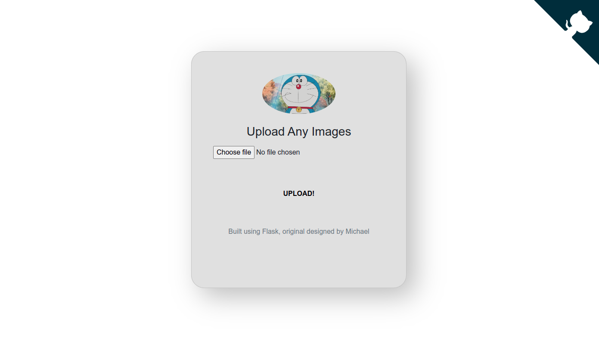

# TRT Model Dectection API

## Demo
[](https://youtu.be/reDtOV7JIe8)

## Model
Here is Yolov7_tiny (trt version) to do prediction

## Intallation
1. Preparation
```
git clone <this_repo>
python3 -m venv v7_env
source v7_env/bin/activate
pip install -r requirements.txt 
```

2. Model Preparation

- Convert yolov7_tiny.pt into simplified `*.onnx` on colab: [[colab source]](https://github.com/WongKinYiu/yolov7/blob/main/tools/YOLOv7trt.ipynb)
```

python export.py --weights ./yolov7-tiny.pt \
        --grid --end2end --simplify \
        --topk-all 100 --iou-thres 0.65 --conf-thres 0.35 \
        --img-size 640 640 --max-wh 640 # For onnxruntime, you need to specify this value as an integer, when it is 0 it means agnostic NMS, 
                     # otherwise it is non-agnostic NMS
# output: 
# Starting ONNX export with onnx 1.12.0...

```


- Download simplified `*.onnx` as `models/coco/yolov7-tiny.onnx`
- Convert simplified `*.onnx` into `*.trt` on the same directory
```
git clone https://github.com/Linaom1214/tensorrt-python.git
python tensorrt-python/export.py -o models/coco/yolov7-tiny.onnx -e models/coco/yolov7-tiny.trt -p fp16
```

3. Flask Setting

Set the environment variables for flask
```
nano .flaskenv

# write the following 2 lines 
FLASK_APP=app.py 
FLASK_ENV=development
````

## Usage

```
flask run
```
## Error 
1. Error on `cuda.stream()` when using flask do prediction
- Reason: flask streams have conflicts with ones from trt 
- Solution: [[csdn]](https://blog.csdn.net/weixin_39739042/article/details/112554503?spm=1001.2101.3001.6650.9&utm_medium=distribute.pc_relevant.none-task-blog-2~default~BlogCommendFromBaidu~default-9.fixedcolumn&depth_1-utm_source=distribute.pc_relevant.none-task-blog-2~default~BlogCommendFromBaidu~default-9.fixedcolumn)
2. 
```
Traceback (most recent call last):
    origin_img = pred.inference('./horses.jpg')
    num, final_boxes, final_scores, final_cls_inds = self.infer(img)
ValueError: not enough values to unpack (expected 4, got 1)

```
- Reason: this problem is due to onnx version is 3. Add Dockerfile 
3. Update flask into Django

## Refer
1. Colab about converting *.pt into onnx and trt: https://github.com/WongKinYiu/yolov7/tree/main/tools
1. Flask structure: https://github.com/Michael-OvO/Yolov7-Flask

